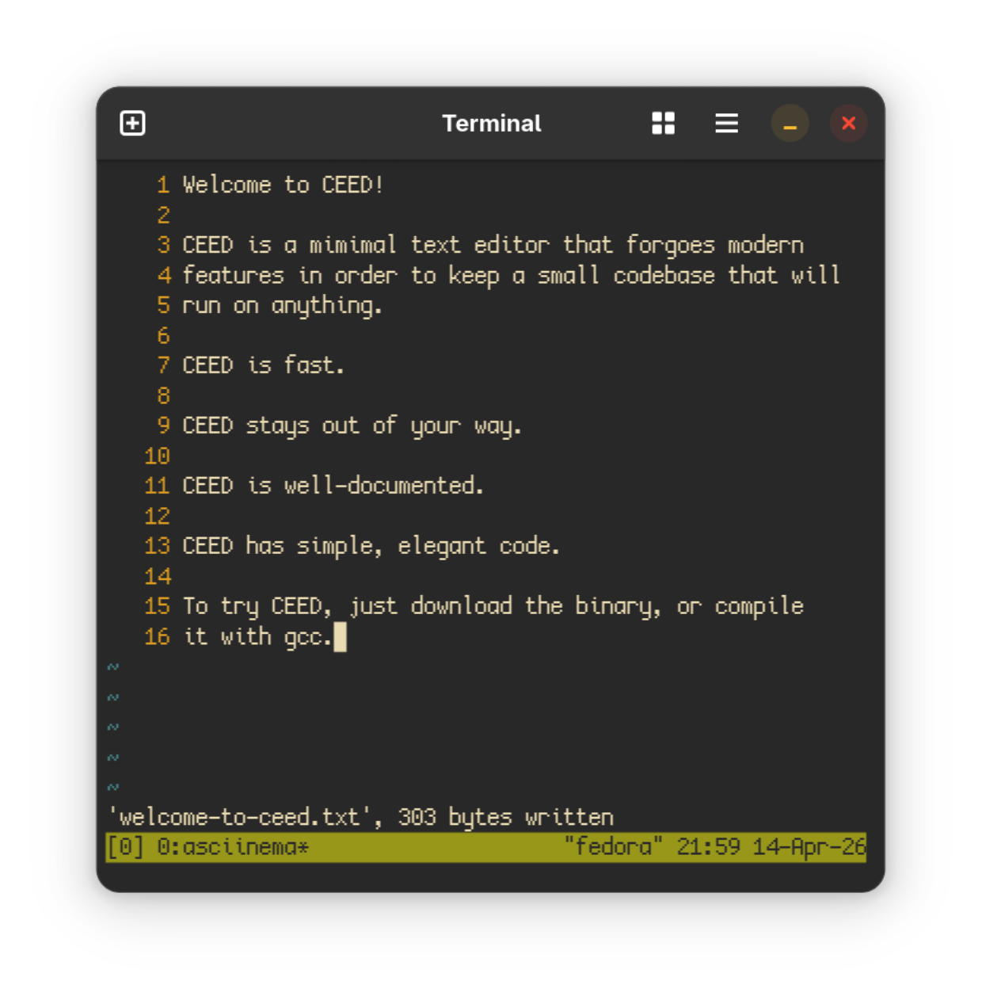

# CEED - C Embedded EDitor

CEED is an extremely lightweight vi-like text editor designed for
remoting into embedded devices (serial/telnet).

<center>
    
</center>

CEED implements the most basic full-screen modal editor possible,
in order to minimise overhead on low-power devices and reduce the
'death by ANSI' that makes most full-screen editors unusable on slow
connections.

The codebase has no dependencies besides libc, and is straightforward
enough to serve as a learning experience in building larger scale
command-line programs in C.

The core of CEED, `hole.h` is an independent header-only library
that you can easily use to create your own text editor, and possibly
take in a completely different direction - `hole.h` is not at all
opinionated.

## Building

To build CEED, install `gcc` and `make` and just run:

```sh
$ git clone "https://github.com/beauconstrictor/ceed
$ cd ceed
$ make
```

(To build on Windows, you will need a POSIX environment like Cygwin)

This will create the `./ceed` binary, which you can move to a
directory in your PATH.

## Manual Page

For more in-depth information on how to use CEED, a manual page,
`ceed.1` is provided which you can read like this:

```sh
$ man ./ceed.1
```

If you wish, you can also install this file systemwide, although
this requires admin permissions:

```sh
$ sudo cp ./ceed.1 /usr/share/man/man1/
```

## Installing

To install CEED locally, either download the Linux binary from the
releases page, or build it yourself.

Then, move the binary into a directory in your PATH such as
`/usr/local/bin` (or `~/.local/bin` for a single-user install, but
you may have to add this to PATH manually). For Windows, you will
probably want to put CEED somewhere with a short path and call it
manually like this:

```pwsh
PS C:\Users\You\ .\Tools\ceed.exe
```

## License & Contributing

CEED uses the open source MIT license, meaning you can do almost
anything you want with the code, as long as you keep that license
message yourself.

If you want to contribute, just create a pull request and I will see
what I can do. Please refrain from massive PRs that add copious
features, as that is not in the spirit of the project, and try to
stick to the conventions already established in my code.
