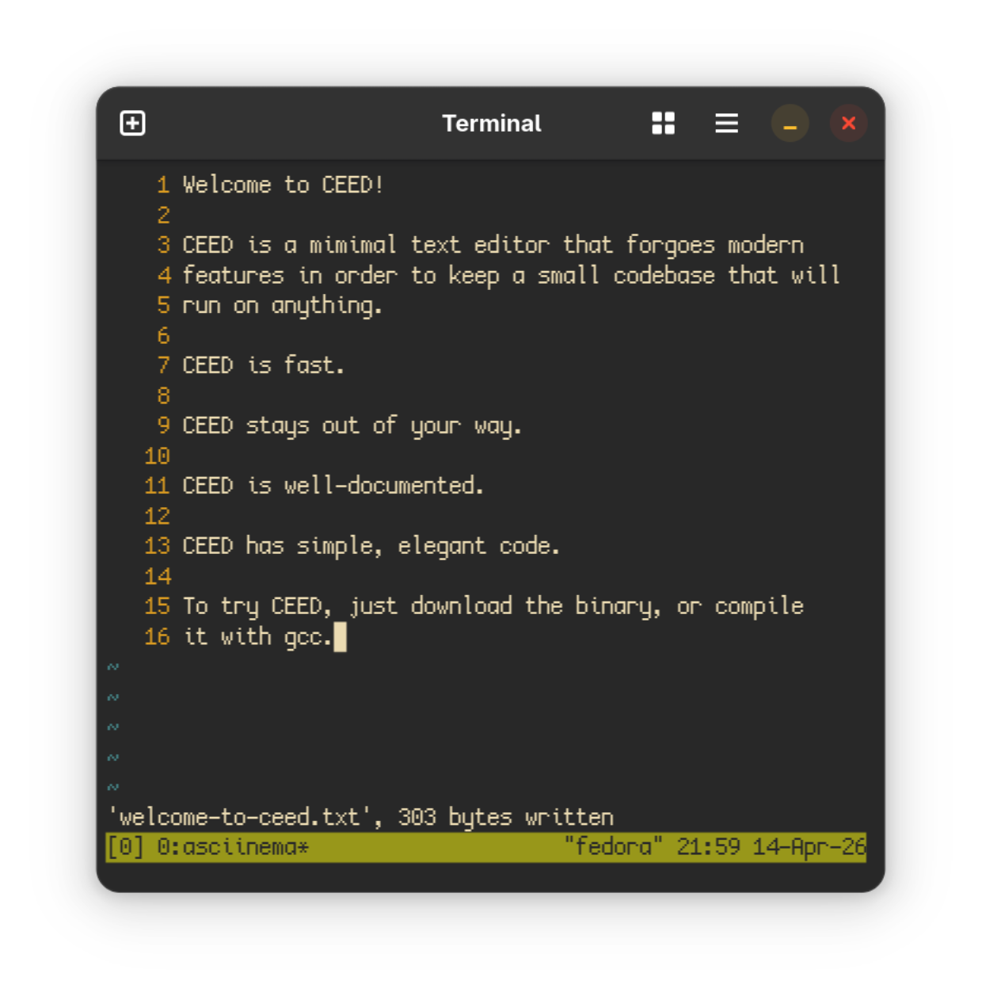

# CEED - C Embedded EDitor

CEED is an extremely lightweight vi-like text editor designed for
remoting into embedded devices (serial/telnet).

<center>
    
</center>

CEED implements the most basic full-screen modal editor possible,
in order to minimise overhead on low-power devices and reduce the
'death by ANSI' that makes most full-screen editors unusable on slow
connections.

The codebase has no dependencies besides libc, and is straightforward
enough to serve as a learning experience in building larger scale
command-line programs in C.

The core of CEED, `hole.h` is a tiny, dependency-free library
that you can easily use to build your own text editor, and possibly
take in a completely different direction - `hole.h` itself is not at
all opinionated, and the structs are transparent.

## Building

To build CEED, install `gcc` and `make` and just run:

```sh
$ git clone "https://github.com/beauconstrictor/ceed
$ cd ceed
$ make
```

(To build on Windows, you will need a POSIX environment like Cygwin)

This will create the `./ceed` binary, which you can move to a
directory in your PATH.

## Installing

To install CEED locally, just use `make install` and add this to
your system's `~/.bashrc` equivalent:

```sh
export CEED_INSTALL=~/.local/share/ceed/
```

If you want to do it manually, either download the zip file from the
Github releases page and unzip it or use `make`. Either way, this will
give you a `build/` directory. Then:

1. Rename `build/` to `ceed/` and move it into `~/.local/share`.
2. Copy `~/.local/share/ceed/ceed` into `~/.local/bin/`.
3. Add `export CEED_INSTALL=~/.local/share/ceed/` to your system's
   `~/.bashrc` equivalent.
4. Restart your shell.

## Platform Support

CEED currently only supports more-or-less POSIX systems such as Linux
distributions and the BSDs. Windows support is impossible without a
POSIX environment such as Cygwin, but you'll have to figure that out
for yourself.

## License & Contributing

CEED uses the open source MIT license, meaning you can do almost
anything you want with the code, as long as you keep that license
message yourself.

If you want to contribute, just create a pull request and I will see
what I can do. Please refrain from massive PRs that add copious
features, as that is not in the spirit of the project, and try to
stick to the conventions already established in my code.
